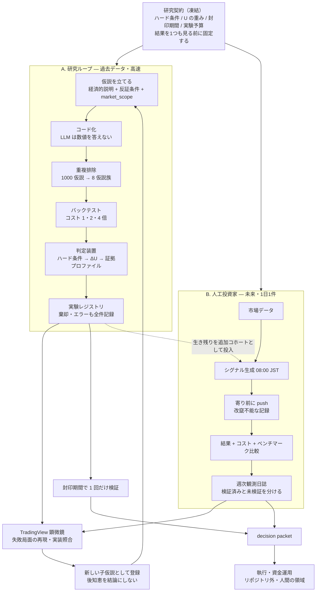

# 定量投資研究ラボ — 全体像

> **「何が効いて何が効かないか」を科学的に確定させる工場を作り、その稼働記録を毎日公開する。**
>
> 銘柄を当てるプロジェクトではない。優位性は「最高の予測モデル」ではなく、**仮説→反証のサイクルを他者より速く・厳密に回せること**に置く。

---

## 全体の流れ



## 2つのトラックの関係

| | **A. 研究ループ** | **B. 人工投資家** |
|---|---|---|
| 対象 | 過去データ | 未来（毎日） |
| 速度 | 速い（実験は一瞬） | 遅い（1日1件） |
| 汚染 | あり（要対策） | **構造的にゼロ** |
| 役割 | 候補を絞る | **証拠を作る** |

**接続点は2箇所**
1. **A → B**：研究で生き残った戦略を、フォワード集合に**追加コホート**として投入（開始コホートとは別集計）
2. **B → A**：フォワードで負けた局面を解剖し、**子仮説**として研究ループへ戻す

---

## 中核原則

| # | 原則 |
|---|---|
| ① | **LLM は数値を答えない。決定論的プログラムを書く。** 結果はファイルに残す |
| ② | **判定装置を生成器より先に作る** |
| ③ | シグナルは独立ではない。**相関を圧縮して独立因子にする** |
| ④ | 新候補は**既存モデルに対する増分情報量**だけで評価する |
| ⑤ | 銘柄ではなく**ルール**を探す |
| ⑥ | 危険なのは試行数ではない。**記録されない試行**と**データに対する仮説数の比**である |
| ⑦ | **未来に向けた記録を、判定装置の完成より先に始める** |

### なぜ②が要るか — 実証済みの事実

**優位性ゼロと分かっているランダムデータ**61銘柄 × 50パラメータ = 3,050試行（[`scripts/selection_bias_demo.js`](../scripts/selection_bias_demo.js)）：

```
Sharpe 1.5以上: 48件
最強: 銘柄#61  Sharpe 2.15  総リターン +34.6%   ← 全部まぐれ
```

さらに深刻なのは、**実データのバックテスト結果（+29.5%, +13.9%, −3.8%, +61.0%）がこのノイズ由来の数字と区別できない**こと。
探すのは簡単すぎる。だから判定装置が要る。

---

## 3つのプロダクト（同じ作業から生まれる）

```
毎日の記録 ──┬─→ ① 人工投資家 …… 改竄不能な稼働記録
             ├─→ ② 観測日誌 …… 週次コンテンツ（＝研究の統制装置）
             └─→ ③ Failure Atlas …… 「効かない」ことの確定した知見
```

公開は宣伝ではなく**統制装置**である。公開していれば、負けている戦略を黙って消せない。

---

## 現在地

| 状態 | |
|---|---|
| ✅ 完了 | 憲章・研究プロトコル・文献の整備／選択バイアスの実証／リプレイと盲検装置の検証／テンプレート3種／日本株データの取得（yfinance・10年・1,188銘柄・287万バー）／品質ゲート3段／ベースライン5種／反証テスト3種 |
| ✅ **2026-08-14** | **研究契約 [`RC-20260812-jp`](../research/contracts/RC-20260812-jp.md) を凍結**。戦略集合も凍結（[`strategy-set.yaml`](../research/forward/jp/strategy-set.yaml)） |
| 🔜 次 | **フォワード記録の開始**（[#27](https://github.com/TIshow/tradingview-mcp/issues/27)）— 毎朝08:00 JST・寄り前push |
| ⏸ その後 | 判定装置（[#7](https://github.com/TIshow/tradingview-mcp/issues/7)）→ 20仮説で v0 を一周 |

**凍結時点のベースライン実測（探索期間 2016-2023・インサンプル）**：ベンチマーク（ユニバース等ウェイト）54.7% に対し、5戦略すべてが負けた。さらに5戦略すべてが位相不変性テストで脆いと判定され、ランダム選択の分布（コスト0）の上位20〜55%に留まった。**教科書的な5戦略はいずれも銘柄選択の情報を示さなかった。**

**データ源の役割分担**：履歴研究は yfinance（10年）、当日シグナルも yfinance（約50ms/銘柄）。J-Quants は約12週間の遅延があるため**当日シグナルには使えない**が、生存者バイアスの無いユニバース確定には使える（[#2](https://github.com/TIshow/tradingview-mcp/issues/2)）。

**v0 の合格条件に「利益の出る戦略を見つける」は入れていない。**
**生き残りゼロでも正常終了することが合格条件**——全候補棄却は判定装置が機能した証拠である。

---

## ドキュメント

| ファイル | 役割 |
|---|---|
| [ai-trading-strategy.md](ai-trading-strategy.md) | **憲章** — 組織構成・中核原則・受け入れ基準・Issue地図 |
| [research-protocol.md](research-protocol.md) | **運用マニュアル** — 11段パイプライン・研究契約・判定・v0 |
| [references.md](references.md) | **科学的基盤** — Reality Check / SPA / Deflated Sharpe / Purged CV |
| [tooling-notes.md](tooling-notes.md) | **装置マニュアル** — 信頼できるツール／壊れているツール |
| [content-pipeline.md](content-pipeline.md) | 副次トラック（記事制作・保留中） |

**成果物** — [`research/`](../research/)：研究契約 / 実験レジストリ / Data Bias Registry / フォワード記録

---

## 期待値（正直に）

- 年間の観測は約250件。**穏当な優位性の統計的検出には数年かかる**
- **1年目の成果は「市場に勝ったか」ではなく「汚染のない記録が存在すること」**
- 成果の大半は**「効かなかった」という確定した知見**になる。これは失敗ではなく資産

## スコープ

研究・検証・記録・公開まで。**実際の発注と資金運用は対象外**（人間の判断と責任の領域）。
教育・分析目的であり、投資助言ではない。
